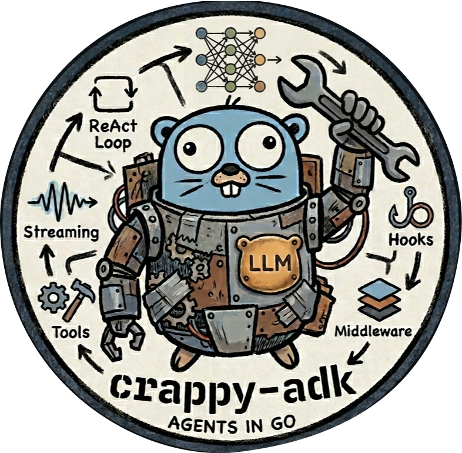

# Crappy Agent Development Kit

<div align="center">
  <br/><br/>

  [](https://golang.org)
  [](https://pkg.go.dev/github.com/vitaliiPsl/crappy-adk)
  [](LICENSE)
</div>

A toolkit for building AI agents in Go. ReAct loop, providers, tools, hooks, and middleware — pick what you need.

## Motivation

Felt bored while on vacation, so decided to learn more about AI agents and build one myself.

## Contents

- [Install](#install)
- [Quick start](#quick-start)
- [Providers](#providers)
- [Tools](#tools)
- [Streaming](#streaming)
- [Multi-turn conversations](#multi-turn-conversations)
- [Hooks](#hooks)
- [Middleware](#middleware)
- [Subagents](#subagents)
- [Extending](#extending)
- [Examples](#examples)
- [License](#license)

## Install

```sh
go get github.com/vitaliiPsl/crappy-adk
```

Requires Go 1.23+.

## Quick start

```go
ctx := context.Background()

provider := google.New()

model, err := provider.Model(ctx, "gemini-2.5-flash", os.Getenv("GEMINI_API_KEY"))
if err != nil {
	log.Fatal(err)
}

agent, err := kit.NewAgent(model,
    kit.WithInstruction("You are a helpful assistant."),
    kit.WithTools(filesystem.NewReadFile(), filesystem.NewListDirectory()),
)
if err != nil {
    log.Fatal(err)
}

result, err := agent.Run(ctx, []kit.Message{
    kit.NewUserMessage(kit.NewTextPart("What does this project do?")),
})
```

## Providers

A provider wraps an LLM API and returns a `kit.Model`. The model handles both blocking (`Generate`) and streaming (`GenerateStream`) calls. The agent doesn't know or care which provider is behind the model.

| Provider | Package | Models |
|---|---|---|
| Anthropic | `providers/anthropic` | claude-opus-4-6, claude-sonnet-4-6, claude-haiku-4-5, ... |
| OpenAI | `providers/openai` | gpt-5, gpt-4.1, gpt-4.1-nano, ... |
| Google Gemini | `providers/google` | gemini-2.5-flash, gemini-2.5-pro, ... |
| Custom (OpenAI-compatible) | `providers/custom` | any model served via Ollama, vLLM, LM Studio, etc. |

All providers support extended thinking where the underlying model offers it. The `custom` provider accepts any base URL, so it works with local and self-hosted inference servers alike.

## Tools

Tools are the actions the agent can take during the ReAct loop. Each tool has a name, a description the model uses to decide when to call it, a JSON schema for its arguments, and an execute function.

### Built-in

| Tool | Package | What it does |
|---|---|---|
| `bash` | `tools/bash` | Run a shell command with a configurable timeout |
| `read_file` | `tools/fs` | Read a file with optional line range |
| `write_file` | `tools/fs` | Write or overwrite a file |
| `edit_file` | `tools/fs` | Replace an exact string within a file |
| `list_directory` | `tools/fs` | List directory contents with a configurable limit |

### Custom tools

`FunctionTool[T]` wraps a typed Go function as a tool. The JSON schema for arguments is generated automatically from `T` — no manual schema definition needed. Arguments are validated against the schema before the handler is called.

```go
type GetTimeInput struct {
    Timezone string `json:"timezone" jsonschema:"IANA timezone name, e.g. America/New_York"`
}

getTime, err := tool.NewFunction(
    "get_time",
    "Get the current time in a given IANA timezone.",
    func(_ context.Context, args GetTimeInput) (string, error) {
        loc, err := time.LoadLocation(args.Timezone)
        if err != nil {
            return "", fmt.Errorf("unknown timezone: %s", args.Timezone)
        }
        return time.Now().In(loc).Format(time.RFC3339), nil
    },
)
```

## Streaming

`Stream` returns a lazy `iter.Seq2` iterator that yields events as they arrive.

```go
stream, err := agent.Stream(ctx, messages)

for event, err := range stream.Iter() {
    if err != nil {
        log.Fatal(err)
    }
    switch event.Type {
    case kit.EventThinkingDelta:
        fmt.Print(event.Text)
    case kit.EventTextDelta:
        fmt.Print(event.Text)
    case kit.EventToolCall:
        fmt.Printf("\n[%s]\n", event.ToolCall.Name)
    case kit.EventToolResult:
        fmt.Printf("[done]\n\n")
    }
}
```

## Multi-turn conversations

The agent is stateless between runs. To continue a conversation, pass the messages from the previous result back on the next call.

```go
result, err := agent.Run(ctx, messages)

// Continue the conversation
messages = append(messages, result.Messages...)
messages = append(messages, kit.NewUserMessage(kit.NewTextPart("follow-up question")))

result, err = agent.Run(ctx, messages)
```

## Hooks

Eight hooks cover every stage of the ReAct loop. Return a modified value to replace the original, or an error to abort. Tool hooks are the exception: an error becomes a tool result and the loop continues.

**`WithOnRunStart`** — once before the loop begins. Returned messages replace the originals.
```go
func(ctx context.Context, messages []kit.Message) (context.Context, []kit.Message, error)
```

**`WithOnRunEnd`** — once after the loop completes. `err` is non-nil if the run failed.
```go
func(ctx context.Context, result kit.Result, err error) (context.Context, error)
```

**`WithOnTurnStart`** — start of each turn, before the model is called.
```go
func(ctx context.Context, messages []kit.Message) (context.Context, []kit.Message, error)
```

**`WithOnTurnEnd`** — end of each turn, after all tools complete.
```go
func(ctx context.Context, messages []kit.Message) (context.Context, error)
```

**`WithOnModelRequest`** — before each model call. Returned request replaces the original.
```go
func(ctx context.Context, req kit.ModelRequest) (context.Context, kit.ModelRequest, error)
```

**`WithOnModelResponse`** — after each model call. Returned response replaces the original.
```go
func(ctx context.Context, resp kit.ModelResponse) (context.Context, kit.ModelResponse, error)
```

**`WithOnToolCall`** — before each tool execution. Return an error to block the call; the error is sent back to the model as the tool result.
```go
func(ctx context.Context, call kit.ToolCall) (context.Context, kit.ToolCall, error)
```

**`WithOnToolResult`** — after each tool execution.
```go
func(ctx context.Context, result kit.ToolResult) (context.Context, kit.ToolResult, error)
```

## Middleware

Middleware wraps the model and intercepts every `Generate` and `GenerateStream` call. Multiple middlewares can be chained.

```go
agent, err := kit.NewAgent(model,
    kit.WithModelMiddleware(middleware.NewRetry(
        middleware.WithMaxAttempts(5),
        middleware.WithBaseDelay(300*time.Millisecond),
        middleware.WithMaxDelay(15*time.Second),
    )),
)
```

## Subagents

`WithSubAgents` registers a `delegate` tool on the parent agent. When called, it runs the target subagent's full ReAct loop and returns its output.

```go
orchestrator, err := kit.NewAgent(model,
    kit.WithInstruction("You are an orchestrator. Always delegate — never answer directly."),
    tool.WithSubAgents(
        tool.SubAgent{Name: "researcher", Description: "...", Agent: researcher},
        tool.SubAgent{Name: "writer",     Description: "...", Agent: writer},
    ),
)
```

## Extending

Everything is an interface. If something doesn't fit, replace it.

- **Provider / Model** — `kit.Provider` + `kit.Model`. Point at any inference backend.
- **Tool** — `kit.Tool`, or use `tool.NewFunction[T]` for auto-schema from a Go struct.
- **Middleware** — `func(Model) Model`. Wrap the model for retry, caching, rate limiting, tracing.
- **Instruction** — `func(ctx) (string, error)`. Evaluated fresh each run, so it can read live state.
- **Compactor** — `kit.Compactor`. Replace the built-in summarizer with any history strategy.
- **Extension** — `kit.WithExtension([]AgentOption)` bundles options into a reusable capability.

## Examples

| Example | What it shows |
|---|---|
| `examples/01-basic` | `Run()`, no tools |
| `examples/02-stream` | `Stream()`, events in real time |
| `examples/03-tools` | `FunctionTool[T]` with a custom typed tool |
| `examples/04-providers` | Anthropic, OpenAI, and Google side by side |
| `examples/05-local-model` | Custom provider with a local model via Ollama |
| `examples/06-multiturn` | Stateless multi-turn conversation pattern |
| `examples/07-hooks` | Token logging and tool timing |
| `examples/08-middleware` | Retry middleware with custom backoff |
| `examples/09-subagents` | Orchestrator with researcher and writer subagents |

Run any example from the repo root:

```sh
GEMINI_API_KEY=... go run ./examples/01-basic
```

## License

MIT — see [LICENSE](LICENSE).
