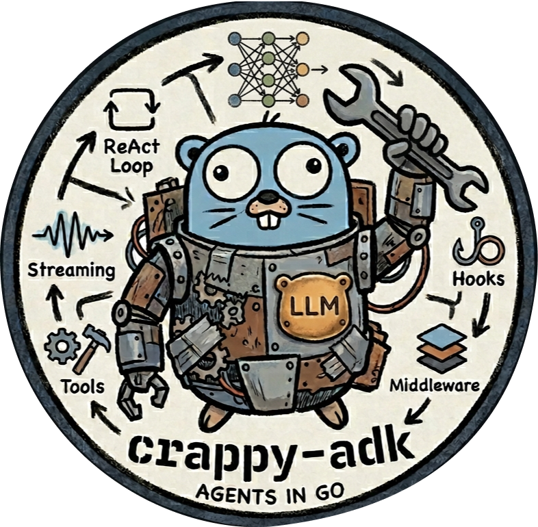

# Crappy Agent Development Kit

<div align="center">
  <br/><br/>

  [](https://golang.org)
  [](https://pkg.go.dev/github.com/vitaliiPsl/crappy-adk)
  [](LICENSE)
</div>

A small toolkit for building AI agents in Go. ReAct loop, memory, models, tools, and extension options.

## Motivation

Felt bored while on vacation, so decided to learn more about AI agents and build one myself.

## Contents

- [Install](#install)
- [Quick start](#quick-start)
- [Memory](#memory)
- [Models](#models)
- [Tools](#tools)
- [Streaming](#streaming)
- [Hooks](#hooks)
- [Summarization](#summarization)
- [Guards](#guards)
- [Testing](#testing)
- [Extending](#extending)
- [Examples](#examples)
- [License](#license)

## Install

```sh
go get github.com/vitaliiPsl/crappy-adk
```

Requires Go 1.26.2.

API documentation: https://pkg.go.dev/github.com/vitaliiPsl/crappy-adk

## Quick start

```go
ctx := context.Background()
mem := memory.NewHistory()

model, err := openai.New(os.Getenv("OPENAI_API_KEY"), "gpt-5.4-nano")
if err != nil {
    log.Fatal(err)
}

type WeatherArgs struct {
    City string `json:"city" jsonschema:"City to get weather for"`
}

weather, err := tool.New(
    "get_weather",
    "Get the current weather for a city.",
    func(_ *kit.RunContext, args WeatherArgs) (string, error) {
        return fmt.Sprintf("%s: 21°C and clear", args.City), nil
    },
)
if err != nil {
    log.Fatal(err)
}

a, err := agent.New(model, mem, tool.NewSet(weather),
    agent.WithInstructions("You are a helpful assistant. Use tools when useful."),
)
if err != nil {
    log.Fatal(err)
}

resp, err := a.Run(ctx, kit.NewUserMessage(
    kit.NewTextContent("What's the weather in Vienna?"),
))
if err != nil {
    log.Fatal(err)
}

fmt.Println(resp.Output.Text)
fmt.Printf("messages produced: %d\n", len(resp.Messages))
fmt.Printf("tokens used: in=%d out=%d\n", resp.Usage.InputTokens, resp.Usage.OutputTokens)
```

## Memory

The agent stores conversation state in `kit.Memory`. Memory records full history and provides the context sent to the model. 

```go
mem := memory.NewHistory()

a, err := agent.New(model, mem, tool.NewSet(),
    agent.WithInstructions("You are a helpful assistant."),
)

resp, err := a.Run(ctx, kit.NewUserMessage(
    kit.NewTextContent("My name is Vitalii."),
))

resp, err = a.Run(ctx, kit.NewUserMessage(
    kit.NewTextContent("What is my name?"),
))
```

## Models

Each model adapter package exposes a `New(...)` constructor that returns a `kit.Model`. The agent doesn't know or care which backend is behind it — it always calls `Stream(...)` internally and assembles the final response.

| Model adapter | Package                    | API                              |
|----------|----------------------------|----------------------------------|
| Anthropic | `providers/anthropic`     | Anthropic Messages API           |
| OpenAI    | `providers/openai`        | OpenAI Responses API             |
| Google    | `providers/google`        | Gemini GenerateContent API       |

All three model adapters support extended thinking via `agent.WithThinking(...)` where the underlying model offers it.

These adapters represent API dialects rather than vendor names. Each adapter can be pointed at a compatible endpoint with `WithBaseURL(...)`.

`providers/openai` targets the OpenAI Responses API and can also point at OpenAI-compatible backends (Ollama, LM Studio, gateways):

```go
model, err := openai.New("", "gemma4",
    openai.WithBaseURL("http://localhost:11434/v1"),
)
```

`providers/anthropic` targets the Anthropic Messages API:

```go
model, err := anthropic.New(apiKey, "claude-compatible",
    anthropic.WithBaseURL("https://your-anthropic-compatible-gateway.example.com"),
)
```

`providers/google` targets the Gemini GenerateContent API:

```go
model, err := google.New(apiKey, "gemini-compatible",
    google.WithBaseURL("https://your-gemini-compatible-gateway.example.com"),
)
```

## Tools

Tools are the actions the agent can take during the ReAct loop. Each tool has a name, a description the model uses to decide when to call it, a JSON schema for its arguments, and an execute function.

`Generic[I, O]` in `x/tool` wraps a typed Go function as a tool. The JSON schema for arguments is generated automatically from `I` — no manual schema definition needed. Arguments are validated against the schema before the handler is called. If `O` is a string the value is returned as-is; any other type is JSON-marshalled before being returned to the model.

```go
type GetTimeInput struct {
    Timezone string `json:"timezone" jsonschema:"IANA timezone name, e.g. America/New_York"`
}

getTime, err := tool.New(
    "get_time",
    "Get the current time in a given IANA timezone.",
    func(_ *kit.RunContext, args GetTimeInput) (string, error) {
        loc, err := time.LoadLocation(args.Timezone)
        if err != nil {
            return "", fmt.Errorf("unknown timezone: %s", args.Timezone)
        }
        return time.Now().In(loc).Format(time.RFC3339), nil
    },
)
```

Use `tool.MustNew(...)` for the panic-on-error variant in test code or top-level vars.

Anything implementing `kit.Tool` works — `Generic` is the convenience wrapper, not a requirement.

An agent's tools are passed to `agent.New` as a `kit.ToolSet`, built with `tool.NewSet(...)`.

```go
a, err := agent.New(model, mem, tool.NewSet(getTime),
    agent.WithInstructions("You are a helpful assistant. Use tools when useful."),
)
```

The `WithTools(...)` option adds more tools after the set is built — this is how extensions register tools of their own.

## Streaming

`Stream` returns a lazy single-consumption iterator that yields fine-grained events as they arrive. Range over it once with `stream.Iter()`, then call `stream.Result()` for the final response and any terminal error. If you call `stream.Result()` before iteration starts, it drains the stream for you. If you stop iterating early, `stream.Result()` returns the partial result accumulated so far and does not resume.

The stream emits content lifecycle events (`content_started`, `content_delta`, `content_done`) for every kind of content — text, thinking, tool calls, and tool results — plus a higher-level `message` event once each message is fully assembled.

```go
stream := a.Stream(ctx, kit.NewUserMessage(
    kit.NewTextContent("Tell me a story."),
))

for event := range stream.Iter() {
    switch event.Type {
    case kit.EventContentStarted:
        switch event.Content.Type {
        case kit.ContentTypeThinking:
            fmt.Println("[thinking]")
        case kit.ContentTypeText:
            fmt.Println("[response]")
        case kit.ContentTypeToolCall:
            fmt.Printf("[tool call] %s\n", event.Content.ToolCall.Name)
        }
    case kit.EventContentDelta:
        switch event.Content.Type {
        case kit.ContentTypeThinking:
            fmt.Print(event.Content.Thinking.Text)
        case kit.ContentTypeText:
            fmt.Print(event.Content.Text.Text)
        }
    case kit.EventContentDone:
        if event.ToolResult != nil {
            if event.ToolResult.Error != "" {
                fmt.Printf("[tool error] %s: %s\n", event.ToolResult.Call.Name, event.ToolResult.Error)
            } else {
                fmt.Printf("[tool result] %s\n", event.ToolResult.Call.Name)
            }
        }
    case kit.EventMessage:
        fmt.Printf("[message %s complete]\n", event.Message.Role)
    }
}

resp, err := stream.Result()
if err != nil {
    log.Fatal(err)
}

fmt.Printf("final text: %s\n", resp.Output.Text)
```

## Hooks

Six hooks cover every stage of the ReAct loop. Each hook receives a pointer to `*kit.RunContext` and may inspect or mutate it. Returning a modified value replaces the original; returning an error aborts the run. Tool hooks are the exception: an error becomes a tool result and the loop continues so the model can react to the failure.

**`WithOnTurnStart`** — start of each turn, before the model is called. Summarization strategies plug in here.
```go
func(rc *kit.RunContext) error
```

**`WithOnTurnEnd`** — end of each turn, after any tool calls in that turn have executed.
```go
func(rc *kit.RunContext) error
```

**`WithOnModelRequest`** — before each model call. Returned request replaces the original.
```go
func(rc *kit.RunContext, req kit.ModelRequest) (kit.ModelRequest, error)
```

**`WithOnModelResponse`** — after each model call. Returned response replaces the original.
```go
func(rc *kit.RunContext, resp kit.ModelResponse) (kit.ModelResponse, error)
```

**`WithOnToolCall`** — before each tool execution. Return an error to block the call; the error becomes the tool result and is sent back to the model.
```go
func(rc *kit.RunContext, call kit.ToolCall) (kit.ToolCall, error)
```

**`WithOnToolResult`** — after each tool execution.
```go
func(rc *kit.RunContext, result kit.ToolResult) (kit.ToolResult, error)
```

`RunContext` carries memory, run messages, cumulative and last-call usage, and the stream emitter. Hooks can inspect memory, record messages, and influence what the model sees on the next turn.

## Summarization

`x/summarization` plugs into `OnTurnStart` to summarize long conversations. A `Trigger` decides when to summarize; a `Strategy` records the summary.

```go
a, err := agent.New(model, memory.NewHistory(), tool.NewSet(),
    agent.WithInstructions("You are a helpful assistant."),
    summarization.WithSummarization(
        summarization.WhenUsageTokensExceed(80_000),
        summarization.Summarize(summarizerModel, "Summarize the conversation so far."),
    ),
)
```

`Summarize` summarizes the current memory context by calling a separate model, then records a `kit.ContentTypeSummary` message in memory. Full history is preserved, and future context starts from the latest summary. The summarizer can be the same model as the agent, or a cheaper one.

`Trigger` and `Strategy` are plain function types — implement your own to use a different policy.

## Guards

`x/guard` provides hook-based runtime policies for stopping runaway or unexpectedly expensive runs. Guards are regular `agent.Option` values, so compose them with the rest of your agent setup.

```go
a, err := agent.New(model, memory.NewHistory(), tool.NewSet(),
    agent.WithInstructions("You are a helpful assistant."),
    guard.WithMaxTurns(12),
    guard.WithMaxToolCalls(40),
    guard.WithInputTokenBudget(80_000),
    guard.WithOutputTokenBudget(8_000),
    guard.WithTotalTokenBudget(88_000),
    guard.WithRepeatedToolCallLimit(2, 4),
)
```

Available guards:

- `WithMaxTurns(n)` stops before the next model call once the run has produced `n` model turns.
- `WithMaxToolCalls(n)` limits total tool calls requested during a run.
- `WithInputTokenBudget(n)`, `WithOutputTokenBudget(n)`, and `WithTotalTokenBudget(n)` limit cumulative accepted usage.
- `WithRepeatedToolCallLimit(maxRepeats, window)` detects repeated identical tool calls by tool name plus arguments, ignoring provider call IDs. The window counts tool-calling model responses including the current one; `window <= 0` checks all prior tool-calling responses.

Guard failures are exported sentinel errors: `ErrMaxTurnsExceeded`, `ErrMaxToolCallsExceeded`, `ErrBudgetExceeded`, and `ErrToolLoopDetected`.

## Testing

`kittest` provides programmable test doubles for `kit.Model` and `kit.Tool` so you can drive the agent loop deterministically in unit tests.

```go
m := kittest.NewModel(t,
    kittest.ModelResult{
        Response: kit.ModelResponse{
            Message:      kit.NewModelMessage(kit.NewTextContent("hello")),
            FinishReason: kit.FinishReasonStop,
        },
    },
)

a, _ := agent.New(m, memory.NewHistory(), tool.NewSet())
resp, err := a.Run(ctx, kit.NewUserMessage(kit.NewTextContent("hi")))
```

The test double records every request it receives, fails the test if the agent makes more calls than scripted, and ships with assertion helpers for inspecting recorded calls.

## Extending

Everything is an interface. If something doesn't fit, replace it.

- **Memory** — `kit.Memory`. Use `memory.NewHistory()` for short-term history and summary-derived context, or implement your own.
- **Model** — `kit.Model`. Point at any inference backend via a model adapter package or implement your own.
- **Tool** — `kit.Tool`, or use `tool.New[I, O]` from `x/tool` for auto-schema from a Go struct. Group tools into a `kit.ToolSet` with `tool.NewSet(...)`.
- **Summarizer** — a `Trigger` plus a `Strategy` registered with `summarization.WithSummarization(...)`.
- **Guard** — runtime policies from `x/guard`, such as turn, tool-call, token-budget, and repeated-tool-call limits.
- **Hooks** — typed function values registered with `WithOn...` options.
- **Extension** — `agent.WithExtensions(opts...)` bundles a set of options into a reusable capability.

## Examples

| Example                  | What it shows                                       |
|--------------------------|-----------------------------------------------------|
| `examples/01-basic`      | `Run()`, no tools                                   |
| `examples/02-tools`      | `tool.MustNew` with a typed custom tool             |
| `examples/03-providers`  | Anthropic, Google, and OpenAI side by side          |
| `examples/04-local-model`| `providers/openai` against a local Ollama server    |
| `examples/05-multi-turn` | Short-term memory conversation pattern              |
| `examples/06-streaming`  | `Stream()`, thinking, text deltas, tool events      |

Run any example from the repo root:

```sh
OPENAI_API_KEY=... go run ./examples/01-basic
```

## License

MIT — see [LICENSE](LICENSE).
